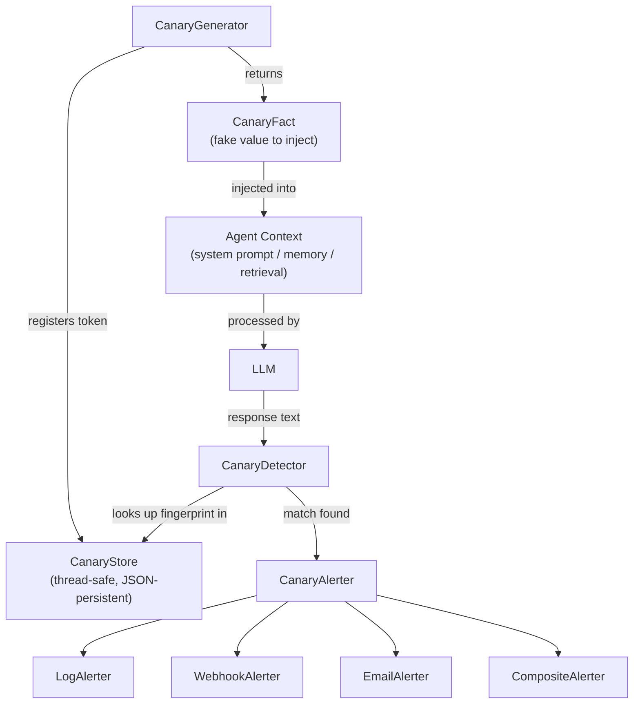

# agent-canary-tokens

[](https://github.com/aumos-ai/agent-canary-tokens)
[](https://pypi.org/project/agent-canary-tokens/)
[](LICENSE)

Plant synthetic canary facts in agent systems to detect memory breaches
and data exfiltration.

A standalone Python security library with zero external dependencies.
Works with any agent framework: LangChain, AutoGen, CrewAI, custom stacks,
or anything that processes text.

---

## Why Does This Exist?

Banks have used dye packs for decades. A dye pack is a device hidden inside a bundle of real currency. If a robber grabs the bundle and takes it out of the bank, the pack detonates — marking the bills with permanent dye that makes them traceable and worthless. The robber walks away thinking they have stolen something valuable. What they actually have is evidence.

AI agents present an analogous problem. An agent ingests sensitive context — user data, internal documents, API credentials — through system prompts, retrieval pipelines, and memory stores. If that context leaks into model outputs, tool calls, or external API requests, the leak is often completely invisible. There is no error. There is no alarm. The agent just keeps running while sensitive data flows somewhere it should not.

Canary tokens are the digital dye pack for AI agents. You plant a fabricated fact that looks entirely real — a fake contact name, a synthetic API key, a document ID that exists nowhere in your actual systems — and you inject it alongside real data in the agent's context. If that canary fact appears anywhere it should not (a model response, a tool call payload, an external log), you know immediately: which context was breached, when the canary was planted, and exactly where the leak appeared.

**What happens without canary tokens?** Data exfiltration by AI agents is silent. You may not discover a prompt injection attack until customer data appears somewhere public. You may not know your retrieval pipeline is leaking until a model starts hallucinating with suspicious specificity. Canary tokens give you tripwires — cheap, low-overhead sensors that fire the moment something goes wrong.

This library is a standalone Python package with zero external dependencies. It works with any agent framework or none at all.

---

## Who Is This For?

| Audience | Use Case |
|---|---|
| **Developers** | Add canary monitoring to any agent pipeline in under 10 lines of code |
| **Security Engineers** | Detect prompt injection, context leakage, and unauthorized data exfiltration |
| **Enterprise** | Compliance and audit trail for sensitive data flowing through LLM systems |

---

## What Problem Does This Solve?

Large language model agents routinely ingest sensitive context — user data,
internal documents, API credentials — through system prompts, memory stores,
and retrieval pipelines.  If that context leaks into model outputs, tool
calls, or logs, it is often invisible without active monitoring.

**Canary tokens** solve this by planting synthetic facts that look real
but are entirely fabricated.  If a canary fact surfaces anywhere it should
not, you know exactly which context was breached, when it was planted, and
where it appeared.

---

## Quick Start

**Prerequisites:** Python 3.10 or later. No other dependencies.

```bash
pip install agent-canary-tokens
```

```python
from agent_canary import CanaryGenerator, CanaryDetector, CanaryStore, LogAlerter

# 1. Set up the canary system (once at startup)
store = CanaryStore()
generator = CanaryGenerator(store=store)
detector = CanaryDetector(store=store, alerter=LogAlerter())

# 2. Plant a canary fact — inject fact.value into your agent's context
fact = generator.plant(context="system_prompt")
print(fact.value)
# Contact: Elowyn Coldfen
# Email: cnry-a1b2c3d4e5f6@canary-test.invalid
# Phone: +1-555-4829301

# 3. After every LLM response, scan for leaks
llm_response = "Here is the contact info: cnry-a1b2c3d4e5f6@canary-test.invalid"
alerts = detector.check_text(llm_response, source="llm_output")
if alerts:
    print(f"Breach detected: {alerts[0].summary()}")
    # Breach detected: canary 'cnry-a1b2c3d4e5f6' appeared in 'llm_output'
```

**Expected output when a leak is detected:**
```
Breach detected: canary 'cnry-a1b2c3d4e5f6' appeared in 'llm_output'
```

**What just happened?** You planted a fabricated contact record into your agent's context. The canary email address (`cnry-a1b2c3d4e5f6@canary-test.invalid`) appears nowhere in your real data. When the LLM response included that address, the detector matched it against the canary store and fired an alert. In a real system, this alert would tell you that your system prompt context is leaking into agent outputs — before any real user data does the same.

---

## Installation

```bash
pip install agent-canary-tokens
```

Requires Python 3.10+.  Zero runtime dependencies.

---

## Core Concepts

| Component | Role |
|---|---|
| `CanaryGenerator` | Selects a strategy, allocates a UUID, registers the token, returns a plantable `CanaryFact` |
| `CanaryStore` | Thread-safe registry of all planted tokens, with JSON persistence |
| `CanaryDetector` | Scans text for active fingerprints, fires alerts on match |
| `CanaryAlerter` | Dispatches alerts via log, webhook, email, or any combination |
| `CanaryStrategy` | Pluggable fact generator — four built-in, one custom delegate |

---

## Built-in Strategies

| Strategy | Category | What it generates |
|---|---|---|
| `FakeContactStrategy` | `contact` | Name, email, phone number |
| `FakeDocumentStrategy` | `document` | Document title, ID, revision, classification |
| `FakeCredentialStrategy` | `credential` | Synthetic API key |
| `FakeURLStrategy` | `url` | Trackable URL with UUID in path |
| `CustomStrategy` | caller-defined | Anything — supply your own functions |

---

## Alerters

```python
from agent_canary import (
    LogAlerter,
    WebhookAlerter,
    EmailAlerter,
    SmtpConfig,
    CompositeAlerter,
)

# Log to Python logging
log_alerter = LogAlerter()

# HTTP POST to a webhook
webhook_alerter = WebhookAlerter(
    url="https://hooks.example.com/canary",
    headers={"Authorization": "Bearer TOKEN"},
)

# SMTP email
email_alerter = EmailAlerter(
    smtp_config=SmtpConfig(host="smtp.example.com", port=465,
                           username="u", password="p"),
    from_address="canary@example.com",
    to_addresses=["security@example.com"],
)

# Fan out to all channels
alerter = CompositeAlerter([log_alerter, webhook_alerter, email_alerter])
```

---

## Persistence

```python
# Save store state to JSON
snapshot = store.to_json()

# Restore in a new process
from agent_canary import CanaryStore
store = CanaryStore.from_json(snapshot)
```

---

## Using Multiple Strategies

```python
from agent_canary import CanaryGenerator, CanaryStore
from agent_canary.strategies import (
    FakeContactStrategy,
    FakeDocumentStrategy,
    FakeCredentialStrategy,
    FakeURLStrategy,
)

store = CanaryStore()
generator = CanaryGenerator(
    strategies=[
        FakeContactStrategy(),
        FakeDocumentStrategy(),
        FakeCredentialStrategy(),
        FakeURLStrategy(),
    ],
    store=store,
)

# Plant with a specific strategy
contact_fact = generator.plant(context="memory", strategy_name="fake_contact")
cred_fact    = generator.plant(context="tool_output", strategy_name="fake_credential")

# Or let the generator pick randomly
random_fact  = generator.plant(context="retrieval")
```

---

## Custom Strategy

```python
from agent_canary.strategies.custom import CustomStrategy
from agent_canary.types import CanaryFact

strategy = CustomStrategy(
    strategy_name="project_code",
    fingerprint_fn=lambda uid: f"PROJ-{str(uid)[:8].upper()}",
    generator_fn=lambda token: CanaryFact(
        token=token,
        value=f"Internal code: {token.fingerprint}",
        category="project_code",
    ),
)

generator = CanaryGenerator(strategies=[strategy], store=store)
```

---

## Architecture Overview



The library is entirely standalone. It has no knowledge of which agent framework you use — it operates on plain text strings. You feed it context when planting, and you feed it LLM output when detecting. Everything in between is your agent.

---

## Examples

Three runnable examples in `examples/`:

- `basic_canary.py` — minimal plant-and-detect workflow
- `webhook_alerting.py` — composite alerter with local webhook receiver
- `agent_memory_canary.py` — full agent session simulation with multiple strategies

---

## Documentation

- `docs/strategies.md` — strategy reference and authoring guide
- `docs/detection.md` — how detection works, performance, thread safety
- `docs/deployment.md` — installation, persistence, rotation, framework integration

---

## Related Projects

| Project | Description |
|---|---|
| [`agents-md-spec`](https://github.com/aumos-ai/agents-md-spec) | Declare what AI agents are allowed to do on your site — the "robots.txt for AI agents" |
| [`mcp-server-trust-gate`](https://github.com/aumos-ai/mcp-server-trust-gate) | Enforce trust level requirements on MCP tool calls before execution |
| [`aumos-core`](https://github.com/aumos-ai/aumos-core) | Core AumOS governance SDK — runtime policy enforcement for agent systems |
| [`aumos-audit-logger`](https://github.com/aumos-ai/aumos-core) | Structured audit trail for agent actions, including canary breach events |

---

## Security

See `SECURITY.md` for the vulnerability disclosure policy.

---

## License

Apache License, Version 2.0
See https://www.apache.org/licenses/LICENSE-2.0 for full text.
Copyright (c) 2026 MuVeraAI Corporation
